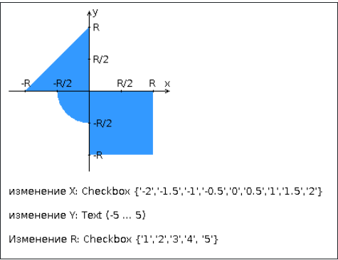

## Лабораторная работа по веб-программированию №1
### Вариант: 1519
### Веб-приложение на HTML, CSS, JavaScript, PHP
 

### HTML-страница формирует данные для отправки PHP-скрипту, который определяет попадание точки на координатной плоскости в заданную область и возвращает HTML-страницу с таблицей, содержащей полученные параметры и результат вычислений - факт попадания или непопадания точки в область  
 

